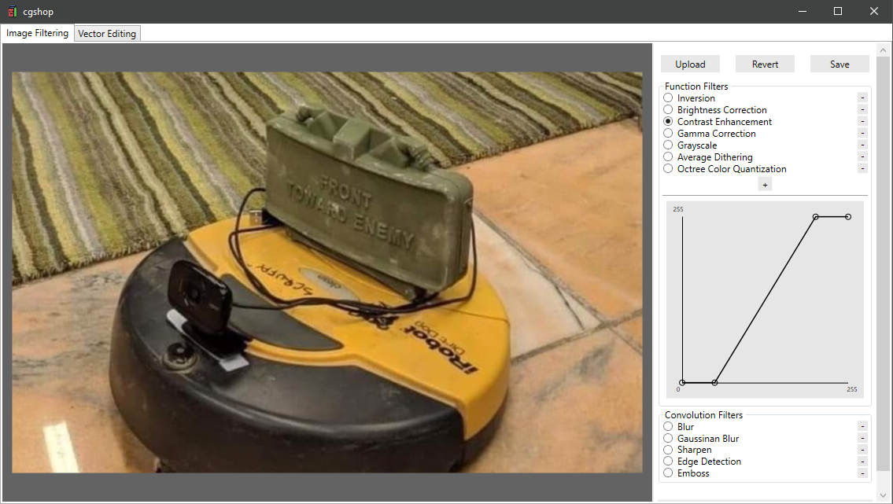
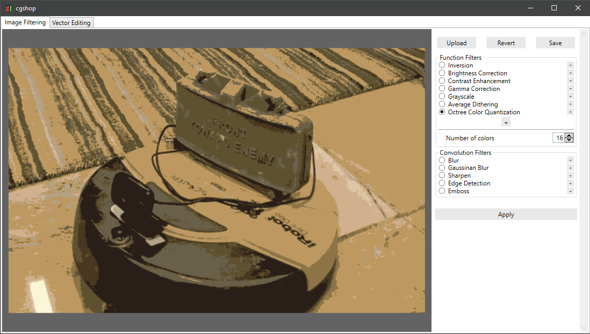
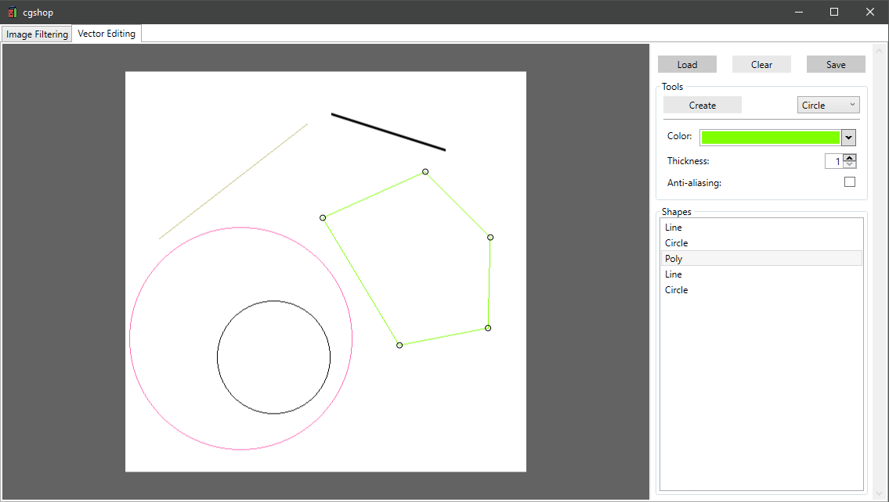

# cgshop
Small photoshop-like program made in WPF for learning low-level graphic algorithms.

## Features

### Image Filtering
- Loading, restoring and saving image in various formats
- Function filters (Inversion, Brightness Correction, Contrast Eenhancement, Gamma Correction, Grayscale)
- Graph for modifying default function filters and new ones
- Average Dithering
- Octree Color Quantization
- Convolution filters (Blur, Gaussian Blur, Sharpen, Edge Detection, Emboss)

### Vector Editing
- Functional vector editor
- Adding vector shapes to canvas (Lines [DDA] , Circles [Midpoint Circle], Polygons)
- Moving vertices of vector shapes
- Changing parameters of vector shapes (Color, Thickness, Anti-aliasing [Gupta-Sproull])

## Screenshots

  
  
  
  
  

