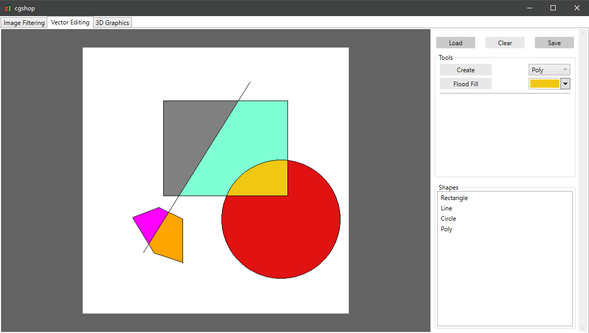
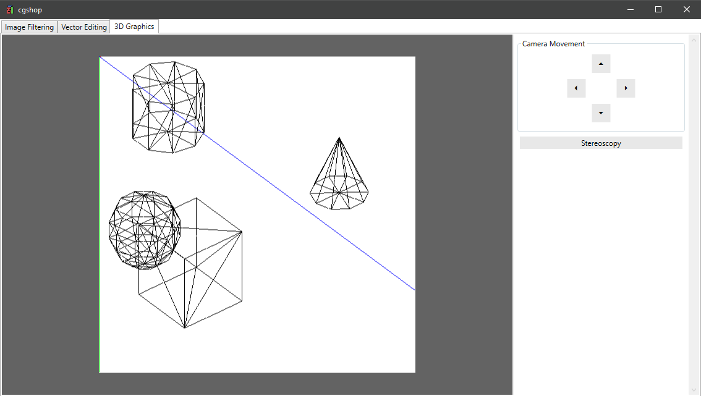

# cgshop
Small photoshop-like program made in WPF for learning low-level graphic algorithms.

## Features

### Image Filtering
- Loading, restoring and saving image in various formats
- Function filters (Inversion, Brightness Correction, Contrast Eenhancement, Gamma Correction, Grayscale)
- Graph for modifying default function filters and new ones
- Average Dithering
- Octree Color Quantization
- Convolution filters (Blur, Gaussian Blur, Sharpen, Edge Detection, Emboss)

### Vector Editing
- Functional vector editor
- Adding vector shapes to canvas (Lines [DDA], Circles [Midpoint Circle], Polygons)
- Moving vertices of vector shapes
- Changing parameters of vector shapes (Color, Thickness, Anti-aliasing [Gupta-Sproull])
- Clipping lines to a convex polygon [Cyrus-Beck]
- Flood-filling shapes with color
- Filling polygons using Scan-Line algorithm with Active Edge Table

### 3D Graphics
- Displaying parametrized 3D shapes (Cuboids, Spheres, Cones, Cylinders)
- Displaying 3D shapes in Anaglyph Stereoscopy mode
- Moving camera

## Screenshots

  
    
  
    
  
    
  
    
  

